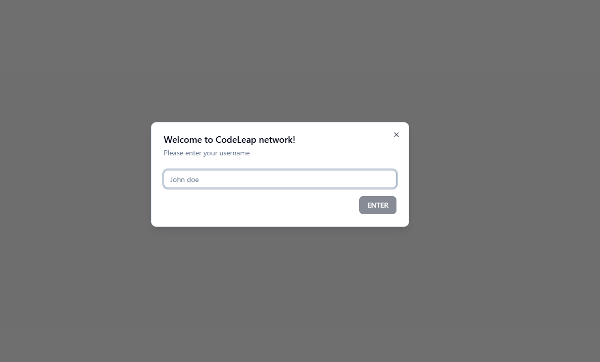
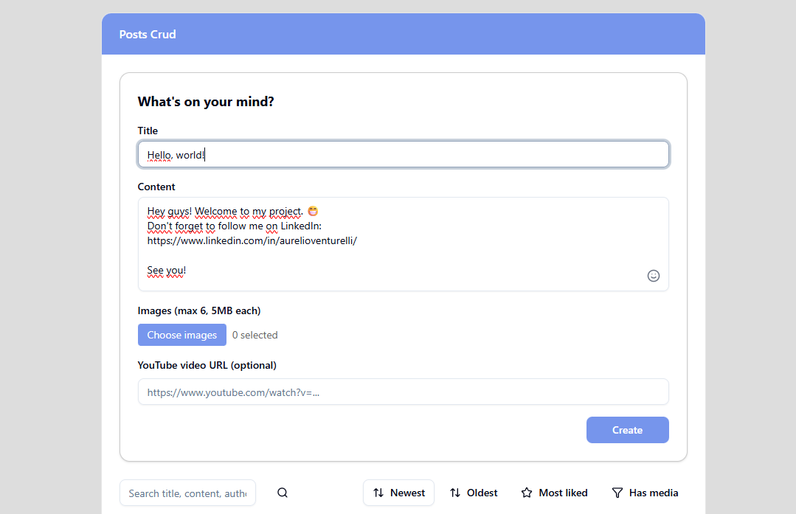
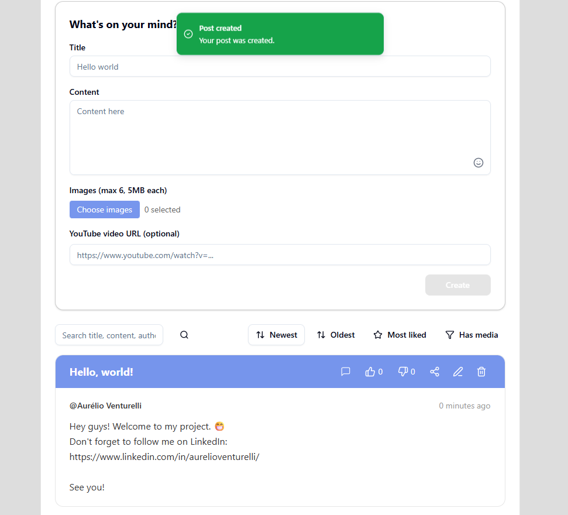
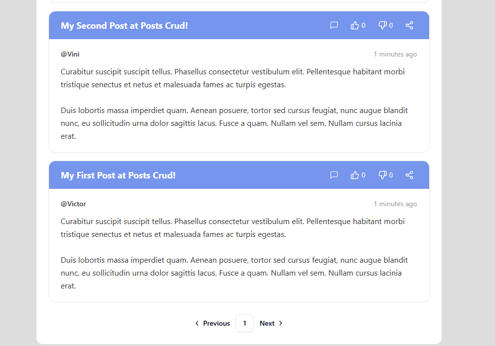
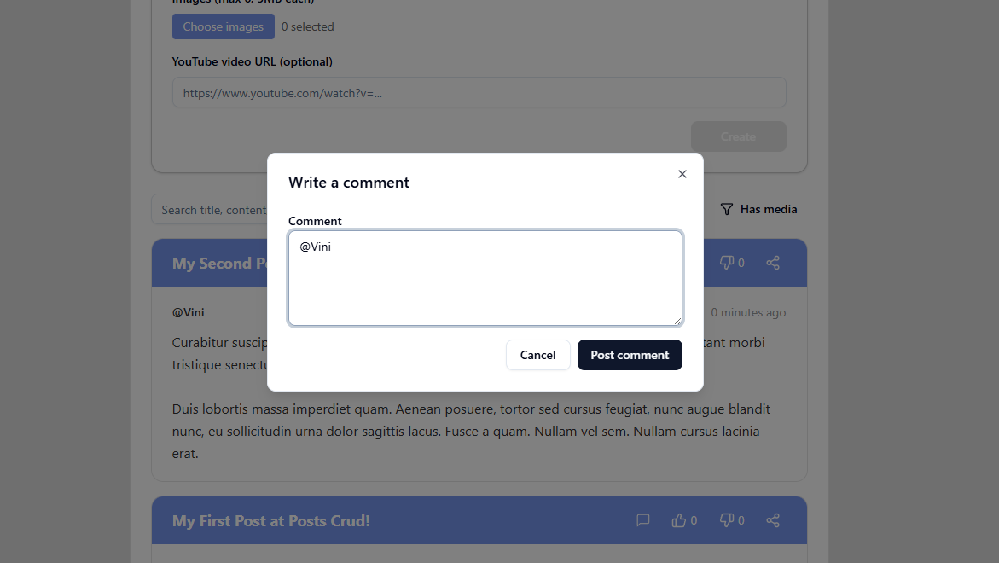
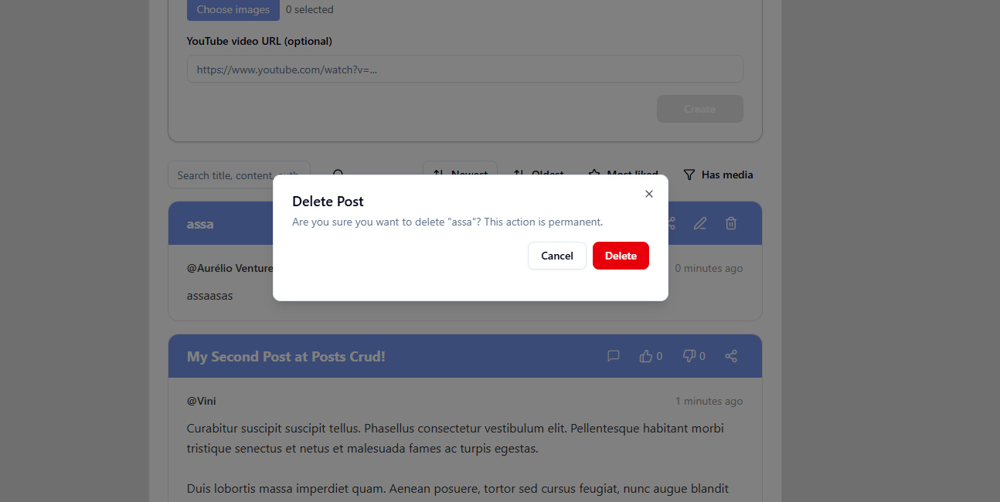

# posts_crud

A simple, extensible Next.js app that demonstrates a full CRUD flow for posts (text + media).

## Features ✅

- Create, read, update and delete posts
- Media upload and display, pagination, and modals (edit, delete, share)
- Optimistic updates and client caching via **React Query**
- Local UI state with **Zustand** and reusable hooks/providers (e.g., `usePosts`, `QueryProvider`)
- Accessible, animated UI built with **Radix** + **Tailwind CSS** + **Framer Motion**

## Tech stack ⚙️

- **Next.js 16 (App Router)** + **TypeScript**
- **Tailwind CSS**, **PostCSS**
- **@tanstack/react-query**, **Zustand**
- **Radix UI**, **Framer Motion**, **Lucide** icons, **Sonner** (toasts)
- Dev: **Biome** (lint/format)

## Project structure 📁

- `app/` – routes, layouts and pages (App Router)
- `components/` – UI components and feature groups
- `hooks/` – reusable hooks (e.g., `usePosts`)
- `lib/` – API client and helpers
- `store/` – global state
- `public/` – static assets

## Quick start 🚀

1. Install dependencies: `npm install`
2. Start dev server: `npm run dev`
3. Open: `http://localhost:3000`

## Development notes 🔧

- Lint: `npm run lint` (Biome)
- Format: `npm run format`
- Build: `npm run build`

## Screenshots 🖼️

A table showing the app screenshots (2 columns × 3 rows):

| Screenshot | Screenshot |
|---|---|
|  |  |
|  |  |
|  |  |

## Contributing

Contributions and issues are welcome — please open a PR or issue with a short description of the change.

## License

No license specified. Add a `LICENSE` file if you want to set one.

> Main code is under `app/` and components under `components/` — see `package.json` for scripts and dependencies.
